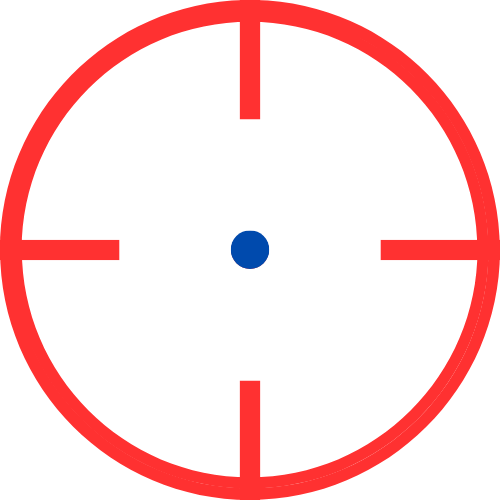

<h1>AIME</h1>

Przetrenuj swoje umiejętności celowania na tej stronie.
Celuj do niebieskich kropek by zdobywać punkty które są następnie zapisywane w rekordzie i w cache.
Czerwone kropki zabijają po ich trafieniu i znikają po 5s.
Jest limit 15 kropek na planszy po przekroczeniu limitu jest koniec gry.
Kropki stawiają się co 650ms.

>>> https://aime.midway.ovh

Ten program jest udostępniany na zasadach licencji MIT License, która wyraźnie określa, że program jest dostarczany "takim jaki jest", BEZ JAKIEJKOLWIEK GWARANCJI, nawet bez domyślnej gwarancji PRZYDATNOŚCI HANDLOWEJ albo PRZYDATNOŚCI DO OKREŚLONYCH CELÓW. Aby uzyskać więcej informacji, zapoznaj się z tekstem licencji MIT License.
